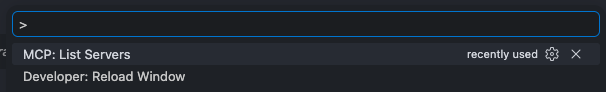
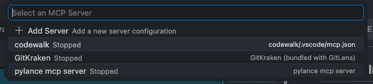
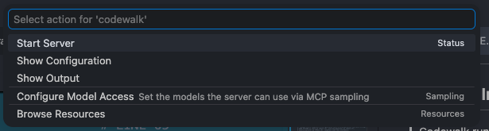
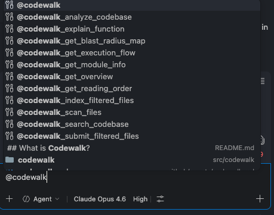

<p align="center">
  <h1 align="center">CODEWALK</h1>
  <p align="center">
    <strong>AI-powered codebase intelligence tool</strong><br>
    Point it at any repo → understand the entire codebase in hours, not weeks
  </p>
</p>

<p align="center">
  <a href="#-features">Features</a> •
  <a href="#-demo">Demo</a> •
  <a href="#%EF%B8%8F-setup">Local Setup</a> •
  <a href="#-cloud-deployment">Cloud</a> •
  <a href="#-mcp-integration">MCP</a> •
  <a href="#-api-reference">API</a> •
  <a href="#-architecture">Architecture</a> •
  <a href="#-contributing">Contributing</a>
</p>

---

## What is Codewalk?

Codewalk analyzes any codebase and gives you:

- **Module detection** — groups files into logical modules automatically
- **Dependency graph** — extracts every import/require → builds the full dependency map
- **Blast radius** — "if I change this file, what breaks?"
- **Reading order** — optimal file reading sequence (dependencies first)
- **Execution flow** — entry points, module-to-module and file-to-file dependency flow
- **AI chat** — ask anything about the code, powered by RAG + tool-calling agent
- **Code review** — review git diffs for bugs, security issues, and style (context-enriched, OWASP-focused)
- **Incremental reindex** — re-embed only changed files using content hash comparison
- **Graph intelligence** — DuckDB + igraph: symbol-level call graph, cycle detection, centrality analysis, import chain tracing
- **Corrective RAG** — distance-based chunk filtering + LLM answer grading + query rewriting for higher quality answers
- **Voice interface** — talk to your codebase hands-free: mic → transcribe → Copilot routes → speak answer

Three ways to use it locally, plus optional cloud indexing:

| Interface | Best for |
|-----------|----------|
| **Web UI** (Next.js) | Visual exploration — diagrams, module browser, blast radius viewer |
| **MCP Server** | VS Code Copilot, Claude Code, Cursor — AI agents use tools directly |
| **REST API** | Scripts, CI/CD, custom integrations |

**Cloud (optional):** Push to GitHub → [Codewalk Cloud](https://api.codewalk.xyz) indexes on the server → MCP downloads the index and queries **locally**. See [Cloud Deployment](#-cloud-deployment).

> **🎙️ Voice** is available via both **MCP** (`codewalk_voice_ask` + `codewalk_speak`) and **REST API** (`POST /voice/ask`) — ask questions by speaking, hear answers read aloud.

---

## Why Codewalk?

| Scenario | How Codewalk helps |
|----------|-------------------|
| **New dev joins the team** | Point Codewalk at the repo → get an overview, module map, and reading order. Self-onboard in hours instead of weeks of "hey, can you explain this?" |
| **LLM token costs are high** | Without RAG, the LLM needs your entire codebase in context — slow and expensive. Codewalk embeds code into a vector DB and retrieves only the relevant chunks per query. Faster answers, fraction of the tokens. |
| **Senior dev switches modules** | You know the auth module but now need to work on payments. Get module info, blast radius, and execution flow without bugging the payments team. |
| **Before a refactor** | Check blast radius before touching shared code. "If I change `base_model.py`, what breaks?" — get the answer before you break prod. |
| **PR reviews** | Run `codewalk_review_diff` or `POST /review` — automated multi-stage review with OWASP security checks, test coverage detection, blast radius warnings, and team guidelines matching. MCP mode leverages the calling model (Claude/GPT) directly — no separate LLM needed. |
| **Documentation is outdated** | Codewalk analyzes the *actual code*, not stale wiki pages. Always up to date. |

---

## ✨ Features

| Feature | Description |
|---------|-------------|
| 🔍 **Module Detection** | Auto-groups files into packages/modules by directory structure |
| 🕸️ **Dependency Graph** | Parses imports across 15+ languages via tree-sitter |
| 💥 **Blast Radius** | BFS on reversed dependency graph → shows transitive impact of any change |
| 📖 **Reading Order** | Topological sort → "read config.py before embedder.py because embedder imports config" |
| 🔄 **Execution Flow** | Entry points, module/file dependency chains, Mermaid diagrams |
| 🤖 **AI Chat** | LangGraph agent with 7 tools, multi-turn conversation with memory |
| 🔎 **Semantic Search** | ChromaDB vector search on embedded code chunks (RAG) |
| 🔬 **Code Review** | Multi-stage review pipeline: test coverage, blast radius, guidelines RAG, context-enriched deep analysis |
| 🔄 **Incremental Reindex** | Content hash comparison — only re-embeds changed files, skips unchanged |
| 🧩 **MCP Server** | 27 MCP tools for VS Code Copilot / Claude Code / Cursor / Codex |
| 🎙️ **Voice Interface** | Talk to your codebase — mic recording, local STT (faster-whisper), agent-driven routing (MCP + API), TTS response |
| 🔬 **Graph Intelligence** | DuckDB persistent graph + igraph C-speed traversal: cycle detection, centrality, import chain tracing |
| 🧬 **Corrective RAG** | Distance-based chunk filtering (free) + LLM answer grading + query rewriting for reliable answers |
| 📦 **Parent-Child Chunking** | Full functions stored as parents, sub-chunks searched — retrieve complete context on match |
| ⚡ **Parallel Embedding** | Producer-consumer pipeline — CPU chunking overlaps with GPU embedding |
| 🏗️ **Multi-Provider LLM** | Ollama (local), OpenAI, Anthropic, Groq, Gemini, OpenRouter, DeepSeek |
| 📚 **Doc Indexing** | Index team docs (.md, .pdf, .txt) — search and ask questions with source citations |
| 🔄 **Reflection** | Actor→Critic→Improve loop for code reviews — catches missed issues, removes false positives |
| 🧑‍💻 **Human-in-the-Loop** | Approval gate before any code/file modification — LangGraph checkpoint + interrupt |
| 🔬 **Deep Research** | Fan-out parallel search → merge → synthesize → reflect for complex cross-cutting questions |
| 🏗️ **Architecture Health** | Graph stats, bottleneck files (betweenness centrality), PageRank, cycle detection with fix suggestions |
| 🌐 **15+ Languages** | Python, JS, TS, Java, Go, Rust, Ruby, PHP, C#, C++, C, Dart, Kotlin, Swift, YAML |

### Supported Languages

| Language | Extensions | Tree-sitter Parsing | Import Extraction |
|----------|-----------|---------------------|-------------------|
| Python | `.py` | ✅ | ✅ |
| JavaScript | `.js`, `.jsx` | ✅ | ✅ |
| TypeScript | `.ts`, `.tsx` | ✅ | ✅ |
| Java | `.java` | ✅ | ✅ |
| Go | `.go` | ✅ | ✅ |
| Rust | `.rs` | ✅ | ✅ |
| Ruby | `.rb` | ✅ | ✅ |
| PHP | `.php` | ✅ | ✅ |
| C# | `.cs` | ✅ | ✅ |
| C++ | `.cpp` | ✅ | ✅ |
| C | `.c` | ✅ | ✅ |
| Kotlin | `.kt` | ✅ | ✅ |
| Swift | `.swift` | ✅ | ✅ |
| Dart | `.dart` | ✅ *(optional install)* | ✅ |
| YAML | `.yaml`, `.yml` | — | — |
| JSON | `.json` | — | — |
| TOML | `.toml` | — | — |
| Markdown | `.md` | — | — |

> **Tree-sitter parsing** = extracts functions, classes, and methods for accurate chunking and function explanations.  
> **Import extraction** = builds the dependency graph, blast radius, and reading order.  
> Languages without tree-sitter support still get indexed via text splitting — they work with semantic search and AI chat, just without function-level granularity.

---

## 🎬 Demo

### Web UI

https://github.com/user-attachments/assets/1bc99516-b3f6-4059-b463-de3c72bc850e

### MCP with VS Code Copilot

https://github.com/user-attachments/assets/a1dfd347-1135-47d2-b01d-3d995d86208e

### REST API

> 🎥 **[Video coming soon]**

### Voice Interface

https://github.com/user-attachments/assets/51d41d48-970f-437e-8c50-e6a104d71e0e

---

## ⚙️ Setup (local)

> **Production cloud server?** See **[FULL_SETUP_GUIDE.md](FULL_SETUP_GUIDE.md)** — step-by-step: Hetzner, `api.codewalk.xyz`, GitHub App, webhooks, MCP download.

### Prerequisites

| Tool | Version | Check |
|------|---------|-------|
| Python | 3.10+ | `python3 --version` |
| Node.js | 18+ | `node --version` |
| Git | Any | `git --version` |
| Ollama *(optional)* | Latest | `ollama --version` |

### 1. Clone the codewalk repo

```bash
git clone https://github.com/gupta29470/codewalk.git
cd codewalk
```

### 2. Backend setup in codewalk

```bash
# Create virtual environment
python3 -m venv .codewalk-env
source .codewalk-env/bin/activate    # macOS / Linux
# .codewalk-env\Scripts\activate     # Windows

# Install Python dependencies
pip install -r requirements.txt
```

<details>
<summary><strong>⚠️ VPN / Corporate Network / Private Network Issues</strong></summary>

If you're behind a **VPN, corporate proxy, or private network**, package installations and model downloads may fail due to blocked connections or SSL certificate errors.

**Recommended: Use a normal (non-VPN) network for first-time setup.**

Codewalk's setup downloads packages from PyPI, npm, and HuggingFace. These are one-time downloads — once installed, everything runs locally. If possible:

1. **Disconnect from VPN** temporarily
2. Run the setup steps (`pip install`, `npm install`, start the backend once to download the embedding model)
3. **Reconnect to VPN** — everything is cached locally, no more downloads needed

> After the first run, Codewalk works fully offline (with Ollama). The VPN/corporate network won't cause any issues.

</details>

<details>
<summary><strong>Optional: Dart/Flutter support (tree-sitter-dart)</strong></summary>

```bash
# If you get an SSH error, run this first:
git config --global url."https://github.com/".insteadOf "git@github.com:"

# Then install:
pip install "tree-sitter-dart @ git+https://github.com/UserNobody14/tree-sitter-dart.git"
```

Without this, Codewalk still works — Dart files just won't get tree-sitter parsing (falls back to text splitting).

</details>

### 3. Frontend setup in codewalk

```bash
cd frontend
npm install
cd ..
```

### 4. Configure environment in codewalk

Copy the template: `cp env.local.example.txt .env` then edit:

```env
# ─── LLM Configuration ──────────────────────────────────────
# Provider: ollama | openai | anthropic | gemini | groq | openrouter
LLM_PROVIDER=ollama
LLM_MODEL=qwen2.5-coder:7b

# ─── Embeddings ──────────────────────────────────────────────
EMBEDDING_MODEL=jinaai/jina-code-embeddings-1.5b

# ─── Repository to Analyze ──────────────────────────────────
# Relative path (self-analysis): src/codewalk
# Absolute path (any repo):      /Users/you/projects/my-app/src
REPO_PATH=src/codewalk

# ─── API Keys (only fill the one you're using) ──────────────
# GROQ_API_KEY=gsk_...
# OPENAI_API_KEY=sk-...
# ANTHROPIC_API_KEY=sk-ant-...
# GOOGLE_API_KEY=AI...
# OPENROUTER_API_KEY=sk-or-...
```

### 5. Pull an Ollama model (if using local LLM)

```bash
ollama pull qwen2.5-coder:7b
```

<details>
<summary><strong>Recommended models by size</strong></summary>

| Model | Size | Tool Calling | Best For |
|-------|------|-------------|----------|
| `qwen2.5-coder:7b` | 4.7 GB | ✅ | Code-focused, fast |
| `qwen3.5:latest` (8B) | 6.6 GB | ✅ | General + code |
| `qwen3.5:27b` | 17 GB | ✅ | Best accuracy |

</details>

---

## 🚀 Usage

### Option 1: Web UI

Open **two terminals** in **codewalk**:

**Terminal 1 — Backend API**
```bash
source .codewalk-env/bin/activate
uvicorn src.codewalk.api.main:app --reload --port 8000
```

**Terminal 2 — Frontend**
```bash
cd frontend
npm run dev
```

Open **http://localhost:3000** → enter a repo path → click **Analyze Codebase**.

Then explore:
- **Overview** — tech stack, modules, dependency diagram, riskiest files
- **Modules** — browse all modules, click one for file list + dependencies
- **Blast Radius** — which files break if you change each file
- **Reading Order** — optimal file reading sequence with risk levels
- **Execution Flow** — Mermaid diagram of module/file dependencies
- **Chat** — ask any question ("explain the authentication flow", "what does scanner.py do?")
- **Code Review** — review git diffs, review single files, load team guidelines
- **Voice** — click the mic, ask a question by speaking, hear the answer read aloud
- **Smart Reindex** — incremental re-embed with stats (skipped, changed, deleted)

### Option 2: MCP Server (VS Code Copilot / Claude Code / Cursor)

See [MCP Integration](#-mcp-integration) below.

### Option 3: REST API

```bash
# Start the backend
source .codewalk-env/bin/activate
uvicorn src.codewalk.api.main:app --reload --port 8000
```

**Step 1 — Analyze a codebase:**
```bash
curl -X POST http://localhost:8000/analyze \
  -H "Content-Type: application/json" \
  -d '{"repo_path": "/path/to/your/repo", "index_mode": "auto"}'
```

**Step 2 — Explore the results:**
```bash
# Project overview (tech stack, modules, riskiest files)
curl http://localhost:8000/overview | python3 -m json.tool

# List all modules
curl http://localhost:8000/modules | python3 -m json.tool

# Dive into a specific module
curl http://localhost:8000/modules/auth | python3 -m json.tool

# What breaks if I change files in the auth module?
curl http://localhost:8000/blast-radius/auth | python3 -m json.tool

# Optimal reading order
curl http://localhost:8000/reading-order | python3 -m json.tool

# Execution flow (entry points, dependency chains)
curl http://localhost:8000/execution-flow | python3 -m json.tool
```

**Step 3 — Chat with the agent:**
```bash
# Ask a question
curl -X POST http://localhost:8000/chat \
  -H "Content-Type: application/json" \
  -d '{"message": "Explain this project", "thread_id": "thread-1"}'

# Follow-up (same thread_id = conversation memory)
curl -X POST http://localhost:8000/chat \
  -H "Content-Type: application/json" \
  -d '{"message": "What does the auth module do?", "thread_id": "thread-1"}'

# After code changes — refresh analysis without re-embedding
curl -X POST http://localhost:8000/refresh

# Incremental reindex — only re-embed changed files
curl -X POST http://localhost:8000/incremental-reindex

# Review current git diff for bugs, security, style
curl -X POST http://localhost:8000/review \
  -H "Content-Type: application/json" \
  -d '{"staged": false, "target_branch": "master"}'
```

See [API Reference](#-api-reference) for full request/response details on every endpoint.

---

## 🔌 MCP Integration

Codewalk runs as an MCP (Model Context Protocol) server, so any AI agent that speaks MCP can use it.

### Cloud MCP (index on server, query locally)

1. Cloud server indexes your repo on `git push` (GitHub App webhook)
2. Clone **codewalk** locally (MCP server code)
3. Open **target repo** in Cursor/VS Code (`${workspaceFolder}`)
4. Configure MCP with cloud URL + repo token:

```json
{
  "servers": {
    "codewalk": {
      "command": "/path/to/codewalk/.codewalk-env/bin/python",
      "args": ["-m", "src.codewalk.mcp.server"],
      "cwd": "/path/to/codewalk",
      "env": {
        "REPO_PATH": "${workspaceFolder}",
        "CODEWALK_SERVER_URL": "https://api.codewalk.xyz",
        "CODEWALK_REPO_NAME": "owner/repo",
        "CODEWALK_REPO_TOKEN": "cw_repo_xxxxxxxx"
      }
    }
  }
}
```

Get `repo_token` after first index (on server):

```bash
docker compose exec postgres psql -U codewalk -d codewalk -c \
  "SELECT repo_token FROM repos WHERE full_name='owner/repo';"
```

Run **`codewalk_connect_repo`** in Cursor or let analyze auto-download the index.

### Local-only MCP (index on your machine)

No cloud — index runs locally via `codewalk_analyze_codebase`. After `rebuild_analysis_cache`, MCP embeds with **`index_from_paths_parallel`** (same pipeline helpers as the API, but MCP scans via `scan_repo_files` + `codewalk.yaml` excludes rather than calling `full_index_parallel` directly).

| Surface | Local embed entrypoint | Notes |
|---------|------------------------|-------|
| **MCP** `codewalk_analyze_codebase` | `index_from_paths_parallel` | `rebuild_analysis_cache` → parallel chunk/embed → `write_manifest` |
| **API** `POST /analyze` (+ `/analyze/stream`) | `full_index_parallel` | Same Chroma output under `REPO_PATH/.codewalk/` |

### Review & approve fixes (agent + MCP)

You talk to your **IDE agent**; the agent calls **Codewalk MCP tools**. Codewalk does not render UI — each host has its own approve/reject experience (Cursor approval cards, Copilot chat, Claude Code prompts, etc.). The agent must present each fix and wait for your approval through that host UI (or yes/no in chat).

1. Agent runs `codewalk_review_diff` → `codewalk_reflect_review`
2. Per fix: `codewalk_approve_action` → you approve/reject in **your host's UI**
3. On approve: `codewalk_apply_fix(..., approval_token=<token>)` (enforced in code)
4. After edits: `codewalk_incremental_reindex`

Full agent rules: `src/codewalk/mcp/server.py` FastMCP `instructions` (sent on MCP connect).

**Example:** `@codewalk review my changes, then fix each issue only after I approve`

**Cloud re-download:** `codewalk_pull_index` / `codewalk_connect_repo` / auto-download on analyze all **replace** local `.codewalk/` (delete then extract). Force refresh: `rm -rf .codewalk` then pull.

### MCP tools — index requirements

| Tool | Index required? | Notes |
|------|-----------------|-------|
| `codewalk_analyze_codebase` | Builds/loads | Cloud download or local embed |
| Query tools (search, overview, modules, …) | Yes | `_require_index()` auto-loads disk |
| `codewalk_incremental_reindex`, `refresh_analysis` | Yes | |
| `codewalk_review_diff` | Soft | Better with index |
| `codewalk_pull_index`, `connect_repo`, `index_status` | Cloud config | Replace `.codewalk/` on download |
| `codewalk_approve_action` / `apply_fix` | No / edits files | Token required for apply |
| Docs / guidelines / voice / `check_version` | Varies | See MCP server `instructions` |

### Starting the MCP Server in VS Code

1. Open VS Code in the codewalk project
2. Press **`Cmd+Shift+P`** (macOS) or **`Ctrl+Shift+P`** (Windows/Linux)
3. Type **`MCP: List Servers`** and select it

   

4. You'll see **`codewalk`** in the list

   

5. Click **Start Server** next to codewalk

   

6. The server starts in the background (stdio transport)
7. Open Copilot Chat → type **`@codewalk`** → all Codewalk MCP tools are available

   


### VS Code Copilot

Add to `.vscode/mcp.json` in your desired project:

> ⚠️ **Replace `/path/to/codewalk`** with the actual absolute path where you cloned codewalk.

```json
{
  "servers": {
    "codewalk": {
      "command": "/path/to/codewalk/.codewalk-env/bin/python",
      "args": ["-m", "src.codewalk.mcp.server"],
      "cwd": "/path/to/codewalk",
      "env": {
        "REPO_PATH": "${workspaceFolder}",
        "EXCLUDE_PATHS": "",
        "REVIEW_GUIDELINES_PATH": "",
        "CODE_DOCS_PATH": ""
      }
    }
  }
}
```

> **`EXCLUDE_PATHS`** — comma-separated list of paths/patterns to skip during scanning. Example: `"tests,docs,scripts/legacy,*.generated.*"`

> **`REVIEW_GUIDELINES_PATH`** — path to a folder of team coding guidelines (.md files). Used by `codewalk_review_diff` and `codewalk_review_file` to check code against your team's standards. Example: `"/path/to/team/review-guidelines"`

> **`CODE_DOCS_PATH`** — default path for team documents (.md, .pdf, .txt). Used by `codewalk_index_docs` if no path argument is given. Example: `"/path/to/team/docs"`

> **Customizing file filters:** Codewalk uses a deterministic file filter ([`src/codewalk/ingestion/file_filter.py`](src/codewalk/ingestion/file_filter.py)) — no LLM involved. If a folder or file is **not being indexed** that you need, you have three options:
>
> 1. **`EXCLUDE_PATHS` env var** — comma-separated dirs/patterns passed via `mcp.json` or `.env`. Example: `"test,docs,*.generated.*"`. These are checked at scan time.
> 2. **`.codewalkignore` file** — gitignore-style patterns in the repo root (see below).
> 3. **Edit `file_filter.py` directly** — remove entries from `SKIP_DIRS`, `SKIP_EXTENSIONS`, `SKIP_FILES`, or `SKIP_SUFFIXES` to allow specific file types that are blocked by default (e.g., `.md`, `.css`, `.sql`, `migrations/`).

> **`.codewalkignore`** — Create a `.codewalkignore` file in the root of the repo you're analyzing to skip specific files/directories:
>
> ```
> # Skip test files
> tests/
> *_test.py
>
> # Skip specific directories
> data/
> wiki/
> blogs/
>
> # Skip specific file patterns
> *.config.js
> setup.py
> ```
>
> **Syntax** (gitignore-like):
> - `folder/` — skip any path containing this directory
> - `*.pattern` — glob match against full path or filename
> - `filename` — matches exact filename or path segment
> - `# comment` — ignored
> - blank lines — ignored
>
> Patterns are cached in `_codewalkignore_patterns` (loaded once per session). If you change the repo being analyzed, `reset_codewalkignore()` clears the cache so the next repo's `.codewalkignore` gets loaded.

Then in Copilot Chat: **`@codewalk`** → it will call `codewalk_analyze_codebase` automatically.

> **Note:** After adding or modifying `.vscode/mcp.json`, reload the VS Code window: **`Cmd+Shift+P`** → **`Developer: Reload Window`**.

### Claude Code

Add to `~/.claude/mcp.json`:

```json
{
  "mcpServers": {
    "codewalk": {
      "command": "python",
      "args": ["-m", "src.codewalk.mcp.server"],
      "cwd": "/path/to/codewalk",
      "env": {
        "REPO_PATH": "/path/to/target/repo",
        "EXCLUDE_PATHS": "",
        "REVIEW_GUIDELINES_PATH": "",
        "CODE_DOCS_PATH": ""
      }
    }
  }
}
```

### Cursor

Settings → MCP Servers → Add:

```json
{
  "codewalk": {
    "command": "python",
    "args": ["-m", "src.codewalk.mcp.server"],
    "cwd": "/path/to/codewalk",
    "env": {
      "REPO_PATH": "/path/to/target/repo",
      "EXCLUDE_PATHS": "",
      "REVIEW_GUIDELINES_PATH": "",
      "CODE_DOCS_PATH": ""
    }
  }
}
```

### OpenAI Codex CLI

Add to `~/.codex/mcp.json`:

```json
{
  "mcpServers": {
    "codewalk": {
      "command": "python",
      "args": ["-m", "src.codewalk.mcp.server"],
      "cwd": "/path/to/codewalk",
      "env": {
        "REPO_PATH": "/path/to/target/repo",
        "EXCLUDE_PATHS": "",
        "REVIEW_GUIDELINES_PATH": "",
        "CODE_DOCS_PATH": ""
      }
    }
  }
}
```

### How It Works (First-Time Setup)

The **first time** you use Codewalk on a new codebase, it needs to index the files.  
You just tell the AI to analyze — **the AI handles the rest automatically**.

### Tool Calling Sequence

```
┌─────────────────────────────────────────────────────────────────────┐
│                    SETUP WORKFLOW (run once)                        │
│                                                                     │
│  Step 1 (only step)                                                 │
│  codewalk_analyze_codebase                                          │
│       │  scans files, builds dependency graph, detects modules,     │
│       │  filters with file_filter.py, chunks, embeds — all in one   │
│       ▼                                                             │
│  ✅ READY — all query tools unlocked                                │
└─────────────────────────────────────────────────────────────────────┘

┌─────────────────────────────────────────────────────────────────────┐
│                   QUERY TOOLS (use after setup)                     │
│                                                                     │
│  codewalk_get_overview          → project summary + dependency flow │
│  codewalk_search_codebase       → semantic code search              │
│  codewalk_get_module_info       → inspect a specific module         │
│  codewalk_explain_function      → AI-powered function explanation   │
│  codewalk_get_blast_radius_map  → change risk analysis              │
│  codewalk_get_reading_order     → optimal file reading sequence     │
│  codewalk_get_execution_flow    → module/file dependency flow       │
│  codewalk_get_architecture_health → bottlenecks, cycles, key files  │
│  codewalk_call_chain(source, target) → trace import path between    │
│  codewalk_index_docs(path)      → index .md/.pdf/.txt docs          │
│  codewalk_search_docs(query)    → search indexed documents           │
│  codewalk_ask_docs(question)    → RAG answer grounded in docs        │
│  codewalk_approve_action(text)  → HITL gate (returns approval_token) │
│  codewalk_apply_fix(..., token) → apply fix after user says yes      │
└─────────────────────────────────────────────────────────────────────┘

┌─────────────────────────────────────────────────────────────────────┐
│                 MAINTENANCE (after code changes)                    │
│                                                                     │
│  codewalk_incremental_reindex   → re-embed only changed files       │
│  codewalk_refresh_analysis      → re-scan without re-embedding      │
│  codewalk_review_diff           → review git diff (context + checks) │
│  codewalk_reflect_review        → self-critique review (reflection)  │
│  codewalk_review_file           → review file vs codebase patterns  │
│  codewalk_load_guidelines       → load team coding standards        │
└─────────────────────────────────────────────────────────────────────┘

┌─────────────────────────────────────────────────────────────────────┐
│                      VOICE (hands-free)                            │
│                                                                     │
│  MCP:  codewalk_voice_ask  → mic → transcribe                       │
│        Copilot picks tool  → calls it → codewalk_speak(summary)     │
│                                                                     │
│  API:  POST /voice/ask     → mic → transcribe → agent invokes tool  │
│        agent answer        → format_voice_response() → MP3          │
└─────────────────────────────────────────────────────────────────────┘
```

> **💡 Before indexing:** Close unnecessary applications (browsers, Slack, Docker, etc.). Indexing loads the embedding model into memory and processes all files at once — freeing up RAM helps it run faster and avoids slowdowns.

**You type this in Copilot Chat:**
```
@codewalk analyze this codebase [auto(default) | reindex(update index) | full(delete existing index and generate new index)]
or
@codewalk_analyze_codebase [auto(default) | reindex(update index) | full(delete existing index and generate new index)]
```

**What happens behind the scenes (you don't need to do anything):**
1. The AI calls `codewalk_analyze_codebase` → scans all files, filters with `file_filter.py`, detects modules, builds the dependency graph, chunks and embeds everything in one call

**You'll see progress like:**
```
✓ Codebase analyzed and indexed successfully
  Files found: 142
  Files indexed: 121
  Chunks embedded: 380
  Modules found: api, analysis, embeddings, ingestion, rag

✅ Ready to answer questions — use query tools directly.
```

> **Note:** After indexing, the AI agent should automatically call these tools. If it doesn't, you can invoke them manually — the hints above tell you exactly which tools to run.

> **Note:** This only happens once. Next time you say `@codewalk analyze this codebase`, it detects the existing index and skips straight to "ready."

### ⚠️ If the AI Stops Mid-Workflow

The setup is now a single call — `codewalk_analyze_codebase` does everything. If the AI stops after that, just call any query tool yourself:

| AI stopped after... | You call next |
|---|---|
| `codewalk_analyze_codebase` | Any query tool — `codewalk_get_overview`, `codewalk_search_codebase`, etc. |

> **Tip:** Look for the **⏩ NEXT STEP** line at the bottom of each tool's output — it tells you exactly what to do.

---

### MCP Tools — What You Can Ask

After indexing is done, here's every tool you can use.  
You don't need to remember tool names — just ask naturally and the AI picks the right tool.

---

#### "Give me the big picture"

**Tool:** `codewalk_get_overview` — no parameters needed

You just joined a new team. You have no idea what this project does. Start here.

```
@codewalk give me an overview of this project
or
@codewalk_get_overview
```

**When to use:** Day 1 on a new project. You want to know what you're dealing with.

---

#### "What's in this module?"

**Tool:** `codewalk_get_module_info(module_name)` — pass the module name

You saw "auth" in the overview and want to dig into it.

```
@codewalk tell me about the auth module
or
@codewalk_get_module_info auth
```

**When to use:** You need to work on a specific module and want to see all its files, classes, and functions at a glance.

---

#### "Explain this function to me"

**Tool:** `codewalk_explain_function(function_name)` — pass the function or class name

Your tech lead mentioned `verify_request` in a PR review. You have no idea what it does.

```
@codewalk explain the verify_request function
or
@codewalk_explain_function verify_request function
```

**When to use:** You see a function name in code/PR/docs and want to understand exactly what it does without reading the whole file yourself.

---

#### "Search for something in the codebase"

**Tool:** `codewalk_search_codebase(query)` — pass any natural language question

You need to find where database connections are handled but don't know which file.

```
@codewalk how does this project handle database connections?
or 
@codewalk_search_codebase how does this project handle database connections?
```

**When to use:** You have a question about a concept ("error handling", "file upload", "caching") and don't know which files to look at.

---

#### "What breaks if I change this?"

**Tool:** `codewalk_get_blast_radius_map(target)` — pass a module name, file name, or leave empty

You're about to refactor `models/base.py`. Before you touch it, you want to know the damage.

```
@codewalk what's the blast radius of base.py / auth?
or
@codewalk_get_blast_radius_map base.py / auth?
```

**When to use:** Before refactoring or making changes. "Is it safe to change this, or will half the project break?"

---

#### "Where should I start reading?"

**Tool:** `codewalk_get_reading_order(module_name)` — pass a module name or leave empty for entire repo

You want to understand the `agent` module but don't know which file to read first.

```
@codewalk what order should I read the agent module?
or 
@codewalk_get_reading_order 
```

**When to use:** You want to understand code without constantly jumping between files wondering "wait, what's this import?"

---

#### "How does the code flow?"

**Tool:** `codewalk_get_execution_flow(module_name)` — pass a module name or leave empty for module-level view

You want to understand how modules connect to each other.

```
@codewalk show me the execution flow
or 
@codewalk_get_execution_flow
```

**When to use:** You want to understand "what calls what" — the big picture of how code connects.

---

#### "I changed some code, refresh the analysis"

**Tool:** `codewalk_refresh_analysis` — no parameters needed

You added 3 new files and refactored a module. The analysis is now stale.

```
@codewalk refresh the analysis
or 
@codewalk_refresh_analysis
```

**When to use:** After you commit code changes and want updated blast radius / reading order / execution flow results.

---

#### "Some files changed, update the embeddings"

**Tool:** `codewalk_incremental_reindex` — no parameters needed

You changed a few files but don't want to re-embed the entire codebase.

```
@codewalk reindex changed files
or
@codewalk_incremental_reindex
```

**When to use:** After code changes when you want the vector search to reflect the latest code without a full re-index. Uses content hashes — only re-embeds what actually changed.

---

#### "Review my changes for bugs"

**Tool:** `codewalk_review_diff` — optional: `staged=true`, `target_branch="master"`

You're about to push a PR and want an automated code review.

```
@codewalk review my changes
or
@codewalk_review_diff
@codewalk_review_diff staged=true target_branch="master"
```

**When to use:** Before pushing a PR. Catches security vulnerabilities (OWASP), bugs, missing test coverage, and style issues. In MCP mode, Copilot performs the review directly using enriched context (full file contents, dependency graph, vector store patterns) — no local LLM overhead, instant results.

---

#### "Review this specific file"

**Tool:** `codewalk_review_file(file_path)` — pass the file path

You want to check if a file follows the project's conventions.

```
@codewalk review src/codewalk/pipeline.py
or
@codewalk_review_file src/codewalk/pipeline.py
```

**When to use:** When you want to review any file — no git diff needed. Reads the file directly, enriches it with caller context (who imports it), security patterns from the vector store, similar code elsewhere in the codebase, and team guidelines. Copilot performs the review natively — no local LLM, instant results.

---

#### "Load our team's coding guidelines"

**Tool:** `codewalk_load_guidelines(docs_path)` — pass path to guidelines directory

Your team has coding standards in markdown files.

```
@codewalk load guidelines from docs/standards
or
@codewalk_load_guidelines docs/standards
```

**When to use:** Once per project. After loading, `codewalk_review_diff` automatically checks code against your team's standards.

---

#### "Talk to the codebase hands-free"

**Tools:** `codewalk_voice_ask` + `codewalk_speak` — no parameters needed

You want to ask a question by speaking instead of typing.

```
@codewalk_voice_ask
```

**What happens:**
1. 🔔 Beep — signals "start talking"
2. 🎙️ Records your voice (up to 30s, stops after 5s of silence)
3. 📝 Transcribes locally via faster-whisper
4. 🧠 Copilot reads the transcript and picks the right codewalk tool
5. ⚙️ Copilot calls the tool and gets the result
6. 🔊 Copilot calls `codewalk_speak(summary)` — speaks a 2-4 sentence summary aloud

**When to use:** Hands-free coding. You're reading code and want to ask "what does this function do?" without switching to the keyboard.

> **Note:** Routing is done by Copilot (full LLM), not a separate model — no Ollama required for MCP voice. The REST API (`POST /voice/ask`) sends the transcript directly to the chat agent, which picks the right tool natively.

---

#### "Is the architecture healthy?"

**Tool:** `codewalk_get_architecture_health` — no parameters needed

You want a health check: bottleneck files, circular dependencies, and the most important files.

```
@codewalk check the architecture health
or
@codewalk_get_architecture_health
```

**Returns:** Graph stats, bottleneck files (betweenness centrality), most important files (PageRank), circular dependencies with suggested fixes.

**When to use:** Before a refactor, code review, or whenever you suspect architectural issues.

---

#### "How does file A reach file B?"

**Tool:** `codewalk_call_chain(source, target)` — two file names

You want to trace the import chain between two files — "how does a change in config.py eventually affect server.py?"

```
@codewalk trace the import chain from config.py to server.py
or
@codewalk_call_chain config.py server.py
```

**Returns:** Shortest import path with hop count and full file paths.

**When to use:** Understanding how changes propagate, debugging import issues, or tracing dependency chains.

---

### Quick Reference — What To Ask

| You want to... | Just say... |
|---|---|
| First-time setup | `@codewalk analyze this codebase`or `@codewalk_analyze_codebase` |
| Big picture overview | `@codewalk give me an overview` or `@codewalk_get_overview` |
| Understand a module | `@codewalk tell me about the auth module` or `@codewalk_get_module_info  auth` |
| Understand a function | `@codewalk explain the verify_request function` or `@codewalk_explain_function verify_request` |
| Find code by concept | `@codewalk how does error handling work?` or `@codewalk_search_codebase how does error handling work?` |
| Check change risk | `@codewalk what's the blast radius of config.py?` or `@codewalk_get_blast_radius_map config.py?` |
| Find riskiest files | `@codewalk show me the riskiest files` |
| Best reading order | `@codewalk what order should I read the agent module?` or `@codewalk_get_reading_order agent module` |
| See dependency flow | `@codewalk show me the execution flow` or `@codewalk_get_execution_flow` |
| After code changes | `@codewalk refresh the analysis` or `@codewalk_refresh_analysis` |
| Update embeddings | `@codewalk reindex changed files` or `@codewalk_incremental_reindex` |
| Review git diff | `@codewalk review my changes` or `@codewalk_review_diff` |
| Self-critique review | `@codewalk reflect on this review` or `@codewalk_reflect_review` |
| Review a file | `@codewalk review src/auth.py` or `@codewalk_review_file src/auth.py` |
| Load guidelines | `@codewalk load guidelines from docs/` or `@codewalk_load_guidelines docs/` |
| Architecture health | `@codewalk check architecture health` or `@codewalk_get_architecture_health` |
| Trace import chain | `@codewalk trace chain from config.py to server.py` or `@codewalk_call_chain config.py server.py` |
| Search team docs | `@codewalk search docs for deployment` or `@codewalk_search_docs deployment` |
| Ask docs a question | `@codewalk how do we deploy?` or `@codewalk_ask_docs how do we deploy` |
| Deep research | `@codewalk research how error handling works across the codebase` |
| Approve then apply fix | `@codewalk review my diff` → per issue: approve → you say yes → apply with token |
| Ask by speaking (hands-free) | `@codewalk_voice_ask` → Copilot calls tool → `@codewalk_speak` |

---

## 📡 API Reference

**Base URL**: `http://localhost:8000`

Start the server:
```bash
source .codewalk-env/bin/activate
uvicorn src.codewalk.api.main:app --reload --port 8000
```

### Analysis Endpoints

#### `POST /analyze` — Index a codebase

```bash
curl -X POST http://localhost:8000/analyze \
  -H "Content-Type: application/json" \
  -d '{
    "repo_path": "/Users/you/projects/my-app",
    "collection_name": "",
    "index_mode": "auto"
  }'
```

**Response:**
```json
{
  "status": "complete",
  "repo_path": "/Users/you/projects/my-app",
  "files_scanned": 142,
  "chunks_created": 380,
  "modules": ["api", "auth", "models", "utils", "frontend"]
}
```

- `index_mode`: `"auto"` (skip if indexed), `"reindex"` (smart update), `"full"` (wipe & rebuild)
- `collection_name`: leave empty — reads `manifest.collection_name` if present, else repo folder name
- **`auto` + index on disk** → load only (`load_scoped_analysis`), no re-embed — same idea as MCP `codewalk_analyze_codebase`
- **No index** → `full_index_parallel` with `codewalk.yaml` excludes (local embed on API server)

#### `POST /analyze/stream` — Index with live progress (SSE)

```bash
curl -N -X POST http://localhost:8000/analyze/stream \
  -H "Content-Type: application/json" \
  -d '{"repo_path": "/Users/you/projects/my-app", "index_mode": "auto"}'
```

**Response (Server-Sent Events)** — `step` values from `analyze_stream()` in `main.py`:

| `step` | When |
|--------|------|
| `init` | Always first — checking existing index |
| `skip` | `index_mode: auto` + `.codewalk/` on disk (load only), or non-full/reindex skip |
| `scan` | Full index or reindex — file scan (`codewalk.yaml` excludes on full) |
| `chunk` | Full index — parallel chunk + embed |
| `embed` | Full index — embed count |
| `store` | Full index — Chroma persist + manifest |
| `reindex` | `index_mode: reindex` — new/changed/deleted counts |
| `analyze` | Dependency graph + module detection |
| `agent` | `state.initialize` (DuckDB, docs, guidelines, agent) |
| `done` | Success (`result` object on final event when complete) |
| `error` | Exception message |

**`index_mode: auto` + existing `.codewalk/`** (fast path):
```
data: {"step": "init", "message": "Checking existing index..."}
data: {"step": "skip", "message": "Loaded existing index (380 chunks)"}
data: {"step": "done", "message": "Analysis complete!", "result": {...}}
```

**`index_mode: full`** (or empty index):
```
data: {"step": "init", "message": "Checking existing index..."}
data: {"step": "scan", "message": "Scanning directory..."}
data: {"step": "scan", "message": "Scanned 142 files (codewalk.yaml excludes applied)"}
data: {"step": "chunk", "message": "Chunking + embedding in parallel..."}
data: {"step": "chunk", "message": "Created 380 chunks"}
data: {"step": "embed", "message": "Embedded 380 chunks"}
data: {"step": "store", "message": "Storing in vector database..."}
data: {"step": "store", "message": "Stored 380 chunks in ChromaDB"}
data: {"step": "analyze", "message": "Building dependency graph..."}
data: {"step": "agent", "message": "Creating AI agent..."}
data: {"step": "analyze", "message": "Detected 5 modules"}
data: {"step": "done", "message": "Analysis complete!", "result": {...}}
```

### API endpoints — index requirements (parity with MCP)

All query endpoints call `state.require_index()` — auto-loads `.codewalk/` from disk after server restart (same as MCP `_require_index()`).

| Endpoint | Index required? | MCP equivalent | Notes |
|----------|-----------------|----------------|-------|
| `POST /analyze` | Builds or loads | `codewalk_analyze_codebase` | API: `full_index_parallel`; MCP local: `index_from_paths_parallel` |
| `POST /analyze/stream` | Builds or loads | same (SSE progress) | Steps: `init`→`skip`/`scan`→`chunk`→`embed`→`store`→`analyze`→`agent`→`done` |
| `POST /chat`, `/chat/stream` | Yes | agent + tools | API HITL via `POST /chat/approve` |
| `GET /overview` | Yes | `codewalk_get_overview` | |
| `GET /modules`, `/modules/{name}` | Yes | `codewalk_get_module_info` | |
| `GET /blast-radius`, `/blast-radius/{m}` | Yes | `codewalk_get_blast_radius_map` | |
| `GET /reading-order` | Yes | `codewalk_get_reading_order` | |
| `GET /execution-flow` | Yes | `codewalk_get_execution_flow` | |
| `GET /architecture`, `/cycles` | Yes | `codewalk_get_architecture_health` | |
| `POST /refresh` | Yes | `codewalk_refresh_analysis` | No re-embed |
| `POST /incremental-reindex` | Yes | `codewalk_incremental_reindex` | `team_config` + manifest collection |
| `POST /review` | Soft (better with index) | `codewalk_review_diff` | Works with partial context |
| `POST /review/file` | Yes | `codewalk_review_file` | |
| `POST /review/guidelines` | No | `codewalk_load_guidelines` | Guidelines Chroma only |
| `POST /review/apply` | No (repo path only) | `codewalk_apply_fix` | Caller approves in UI; no token gate |
| `POST /docs/index`, `/docs/search`, `/docs/ask` | Doc index only | `codewalk_index_docs` etc. | |
| `POST /voice/ask` | Yes | `codewalk_voice_ask` | |
| `POST /research` | Yes | deep research | |
| `GET /health` | No | — | |
| Cloud `GET /indexes/...` | Download only | `codewalk_pull_index` | Blocked when cloud-only mode |

**Cloud API server** (`DATABASE_URL` set): query endpoints above return 400 — indexes are built on server, queried locally via MCP download.

#### `POST /refresh` — Re-scan without re-embedding

```bash
curl -X POST http://localhost:8000/refresh
```

**Response:**
```json
{
  "status": "refreshed",
  "files": 142,
  "modules": ["api", "auth", "models", "utils", "frontend"]
}
```

---

### Chat Endpoint

#### `POST /chat` — Ask the AI agent a question

```bash
curl -X POST http://localhost:8000/chat \
  -H "Content-Type: application/json" \
  -d '{"message": "Explain how authentication works in this project", "thread_id": "thread-1"}'
```

**Response:**
```json
{
  "answer": "The authentication flow starts in auth/middleware.py which checks JWT tokens on every request. The token validation logic is in auth/jwt.py which uses the python-jose library...",
  "thread_id": "thread-1"
}
```

Multi-turn conversation — use the same `thread_id`:
```bash
# Follow-up question
curl -X POST http://localhost:8000/chat \
  -H "Content-Type: application/json" \
  -d '{"message": "What happens if the token expires?", "thread_id": "thread-1"}'
```

---

### View Endpoints

#### `GET /overview` — Project overview

```bash
curl http://localhost:8000/overview
```

**Response:**
```json
{
  "tech_stack": ["Python", "FastAPI", "React"],
  "total_files": 142,
  "total_modules": 5,
  "modules": [
    {"name": "api", "file_count": 12, "depends_on": ["auth", "models"]},
    {"name": "auth", "file_count": 5, "depends_on": ["models"]}
  ],
  "diagram": "graph TD\n    api --> auth\n    api --> models\n    auth --> models",
  "overview_text": "## Project Overview\nTech stack: Python, FastAPI...",
  "riskiest_files": [
    {"file": "models/base.py", "risk_level": "high", "affected_files": 23}
  ]
}
```

#### `GET /modules` — List all modules

```bash
curl http://localhost:8000/modules
```

**Response:**
```json
{
  "modules": [
    {"name": "api", "file_count": 12, "languages": ["python"]},
    {"name": "auth", "file_count": 5, "languages": ["python"]},
    {"name": "frontend", "file_count": 34, "languages": ["typescript", "css"]}
  ],
  "total": 5
}
```

#### `GET /modules/{name}` — Module details

```bash
curl http://localhost:8000/modules/auth
```

**Response:**
```json
{
  "name": "auth",
  "file_count": 5,
  "files": ["auth/middleware.py", "auth/jwt.py", "auth/permissions.py", "auth/models.py", "auth/__init__.py"],
  "languages": {"python": 5},
  "depends_on": ["models"],
  "depended_by": ["api"],
  "blast_radius": [
    {"file": "auth/middleware.py", "risk_level": "moderate", "affected_files": 8}
  ],
  "module_risk": "moderate"
}
```

#### `GET /blast-radius` — Top 15 riskiest files

```bash
curl http://localhost:8000/blast-radius
```

**Response:**
```json
{
  "module": null,
  "module_risk": "high",
  "total_files": 15,
  "files": [
    {
      "file": "models/base.py",
      "risk_level": "high",
      "affected_files": 23,
      "direct": ["api/routes.py", "auth/models.py"],
      "transitive": ["api/views.py", "auth/middleware.py"]
    }
  ]
}
```

#### `GET /blast-radius/{module}` — Blast radius for a module

```bash
curl http://localhost:8000/blast-radius/auth
```

#### `GET /reading-order` — Recommended reading order

```bash
curl http://localhost:8000/reading-order
```

**Response:**
```json
{
  "order": [
    {
      "file": "config.py",
      "position": 1,
      "why": "No internal dependencies",
      "risk_level": "moderate",
      "affected_files": 12,
      "direct": ["embedder.py", "chain.py"],
      "transitive": ["pipeline.py"]
    },
    {
      "file": "models/base.py",
      "position": 2,
      "why": "No internal dependencies | Used by: routes.py, views.py",
      "risk_level": "high",
      "affected_files": 23
    }
  ]
}
```

#### `GET /execution-flow` — Execution flow diagram

```bash
curl http://localhost:8000/execution-flow
```

**Response:**
```json
{
  "flow": "## Execution Flow — Module Level\nEntry modules: api, cli\nTotal modules: 5\n\n### Module Dependencies\n  api (12 files) → depends on: auth, models\n  auth (5 files) → depends on: models\n  models (8 files) → (standalone)\n  utils (6 files) → (standalone)\n  frontend (34 files) → (standalone)"
}
```

---

### Maintenance Endpoints

#### `POST /incremental-reindex` — Re-embed only changed files

```bash
curl -X POST http://localhost:8000/incremental-reindex
```

**Response:**
```json
{
  "repo_path": "/Users/you/projects/my-app",
  "files_on_disk": 142,
  "files_skipped": 138,
  "files_reindexed": 3,
  "files_deleted": 1,
  "chunks_embedded": 12,
  "total_time": "2.3s"
}
```

---

### Review Endpoints

#### `POST /review` — Review git diff

```bash
curl -X POST http://localhost:8000/review \
  -H "Content-Type: application/json" \
  -d '{"staged": false, "target_branch": "master"}'
```

**Response:**
```json
{
  "issues": [
    {
      "severity": "critical",
      "category": "security",
      "file_path": "src/auth/jwt.py",
      "line_number": 42,
      "title": "JWT secret hardcoded",
      "explanation": "The JWT signing secret is hardcoded in the source file.",
      "suggestion": "Move the secret to an environment variable.",
      "code_snippet": "SECRET = 'my-secret-key'"
    }
  ],
  "summary": "Found 1 critical issue in 3 files (+45 / -12 lines)",
  "files_reviewed": 3,
  "lines_added": 45,
  "lines_removed": 12
}
```

- `staged`: If `true`, review only staged changes (`--staged`). Default: `false`.
- `target_branch`: Diff against a branch (e.g. `"master"` for full PR review). Default: `null` (unstaged changes).

#### `POST /review/file` — Review a single file

```bash
curl -X POST http://localhost:8000/review/file \
  -H "Content-Type: application/json" \
  -d '{"file_path": "src/codewalk/pipeline.py"}'
```

**Response:**
```json
{
  "review": "## File Review: pipeline.py\n\n### Consistency...\n",
  "file_path": "src/codewalk/pipeline.py"
}
```

#### `POST /review/guidelines` — Load coding guidelines

```bash
curl -X POST http://localhost:8000/review/guidelines \
  -H "Content-Type: application/json" \
  -d '{"docs_path": "/path/to/guidelines"}'
```

**Response:**
```json
{
  "status": "loaded",
  "chunks": 24,
  "path": "/path/to/guidelines"
}
```

---

### Voice Endpoint

#### `POST /voice/ask` — Voice-in, voice-out Q&A

Upload an audio file (webm/mp3/wav from browser mic). Codewalk transcribes it, sends it to the chat agent (which picks the right tool natively), and returns both the text answer and a spoken MP3 response.

```bash
curl -X POST http://localhost:8000/voice/ask \
  -F "audio=@question.webm" \
  -F "thread_id=voice"
```

**Response:**
```json
{
  "question": "what does the auth module do?",
  "answer": "The auth module contains 5 files handling JWT validation...",
  "speech": "The auth module handles JWT validation and permissions.",
  "audio_base64": "SUQzBAAAAAAAI1RTU0UAAAA..."
}
```

- `audio` *(required)*: Audio file upload (webm, mp3, wav)
- `thread_id` *(optional)*: Conversation thread ID. Default: `"voice"`
- `audio_base64`: Base64-encoded MP3 of the spoken answer — decode and play in the browser

**Pipeline:** audio upload → faster-whisper STT → chat agent (picks tool natively) → summarize → edge-tts → MP3 response

---

#### `GET /health` — Health check

```bash
curl http://localhost:8000/health
```

**Response:**
```json
{
  "status": "ok"
}
```

---

## ☁️ Cloud Deployment

Production API: **`https://api.codewalk.xyz`** (indexing + webhooks + index download).  
Marketing site (optional): **`https://codewalk.xyz`**

### Architecture

```
git push → GitHub App webhook → api.codewalk.xyz → index stored
                                        ↓
Local MCP → GET /indexes/{owner}/{repo} → query locally
```

| Component | Where | Role |
|-----------|-------|------|
| **Cloud server** | Hetzner + Docker | Index on push only |
| **GitHub Actions** | GitHub | Build image + deploy server |
| **GitHub App** | GitHub | Send `push` webhooks (must **install** app on repos) |
| **Local MCP** | Your laptop | Download index, run queries |

### Quick start

1. Follow **[FULL_SETUP_GUIDE.md](FULL_SETUP_GUIDE.md)** (complete step-by-step)
2. Server `.env`: `cp env.server.example.txt` → `/opt/codewalk/.env`
3. GitHub App webhook: `https://api.codewalk.xyz/webhooks/github`
4. **Install App** on each repo to index (creating the app is not enough)
5. **`git push`** to that repo — this registers it and starts indexing (install alone is not enough)
6. Verify: `POST /admin/repos` with `X-Admin-Key` → `index_status: ready`
7. Get `repo_token` from DB → set `CODEWALK_REPO_TOKEN` in MCP config

**Day-to-day server ops:** [deploy/SERVER_OPS.md](deploy/SERVER_OPS.md) — health, SQL, logs, [reset-repo.sh](deploy/reset-repo.sh) (prepare/reset/delete, `--dry-run`).

### Indexing a repo (checklist)

| Step | Required for indexing? |
|------|------------------------|
| Server running + cloud `.env` (App ID, PEM, webhook secret) | Yes |
| GitHub Actions secrets (`HETZNER_*`) | No — deploy only |
| Install GitHub App on the repo | Yes |
| `git push` to the repo | Yes — triggers register + index |
| `repo_token` in local MCP | Yes — for downloading the index |

> GitHub Actions **deploys the server**. **Indexing** is triggered by **GitHub App `push` webhooks**, not Actions.

### Per-repo team config (`codewalk.yaml`)

Each indexed repo can have a `codewalk.yaml` at its root:

```yaml
indexing:
  branches:          # only these branches trigger indexing (fnmatch)
    - master
    - release/**
  exclude:
    - frontend/**
    - build/**
    - docs/**
```

Cloud reads this on every index. Pushes to other branches are ignored. See [FULL_SETUP_GUIDE.md § Phase 7](FULL_SETUP_GUIDE.md#9-phase-7--team-config-codewalkyaml).

### Config templates

| File | Use |
|------|-----|
| [FULL_SETUP_GUIDE.md](FULL_SETUP_GUIDE.md) | Complete A→Z setup |
| [deploy/DEPLOY.md](deploy/DEPLOY.md) | Deployment guide |
| [deploy/SERVER_OPS.md](deploy/SERVER_OPS.md) | Server ops — health, indexing, SQL, [reset-repo.sh](deploy/reset-repo.sh) |
| [env.server.example.txt](env.server.example.txt) | Hetzner `/opt/codewalk/.env` |
| [env.local.example.txt](env.local.example.txt) | Local dev `.env` |
| [mcp.json.example](mcp.json.example) | MCP config → `.vscode/mcp.json` |
| [env.example.txt](env.example.txt) | All env vars index |

### CI/CD (GitHub Actions)

Push to `master` → build image → GHCR → deploy to Hetzner (`deploy-server.sh` syncs compose + Caddyfile).

**Secrets:** `HETZNER_HOST`, `HETZNER_USER`, `HETZNER_SSH_KEY`

> GitHub Actions **deploys the server**. **Indexing** is triggered by **GitHub App push webhooks**, not Actions.

---

## 🏗️ Architecture

```
┌─────────────────────────────────────────────────────────┐
│                      INTERFACES                         │
│                                                         │
│   Next.js Web UI (:3000)    MCP Server    REST API      │
│   ├── Overview              (stdio)       (:8000)       │
│   ├── Modules                  │             │          │
│   ├── Blast Radius             │             │          │
│   ├── Reading Order        Voice Interface   │          │
│   ├── Execution Flow       (mic → speak)     │          │
│   ├── Code Review              │             │          │
│   ├── Smart Reindex            │             │          │
│   └── Chat ──────────────────┐ │             │          │
│                              ▼ ▼             ▼          │
├──────────────────────────────────────────────────────────┤
│                     AGENT LAYER                          │
│                                                          │
│   LangGraph StateGraph ─── LLM (bind_tools) ───┐        │
│          │                                      │        │
│          ▼                                      ▼        │
│   ┌─ 7 Agent Tools ──────────────────────────────┐       │
│   │ search_codebase    get_overview              │       │
│   │ get_module_info    get_blast_radius_map       │       │
│   │ explain_function   get_reading_order          │       │
│   │                    get_execution_flow         │       │
│   └──────────────────────────────────────────────┘       │
├──────────────────────────────────────────────────────────┤
│                    ANALYSIS LAYER                         │
│                                                          │
│   scanner.py ──► dependency_graph.py ──► module_detector │
│                         │                                │
│                         ▼                                │
│   blast_radius.py   reading_order.py   code_parser.py    │
│   (BFS reverse       (topological      (tree-sitter      │
│    graph)             sort)              15+ langs)       │
├──────────────────────────────────────────────────────────┤
│                    GRAPH LAYER                           │
│                                                          │
│   graph/store.py ──► graph/runtime.py                    │
│   (DuckDB 7-table     (igraph C-speed                    │
│    persistent          traversal: cycles,                 │
│    graph)              centrality, paths)                 │
│                                                          │
│   .codewalk/graph.duckdb  ◄── files, imports, symbols,   │
│                               symbol_calls, chunks,       │
│                               modules, module_deps        │
├──────────────────────────────────────────────────────────┤
│                    REVIEW LAYER                          │
│                                                          │
│   diff_parser.py → test_coverage.py → reviewer.py        │
│   (git diff         (11-lang test       (8-step          │
│    parsing)          detection)          pipeline)        │
│                                                          │
│   guidelines_loader.py → review_prompts.py               │
│   (team standards       (OWASP security                  │
│    RAG search)           checklist)                       │
├──────────────────────────────────────────────────────────┤
│                   EMBEDDING LAYER                        │
│                                                          │
│   chunker.py ──► embedder.py ──► vector_store.py         │
│   (smart code     (Jina 1.5B     (ChromaDB               │
│    chunks)         MPS/CUDA)      persistent)             │
├──────────────────────────────────────────────────────────┤
│                     VOICE LAYER                          │
│                                                          │
│   ┌── mic ──► stt.py ──► router.py ──► tool exec ──┐    │
│   │  sounddevice   faster-whisper   get_llm()          │    │
│   │  (record)      (transcribe)     (route to tool) │    │
│   │                                                 │    │
│   │            ┌─ content tool? ─┐                   │    │
│   │            │  YES            │ NO (admin)        │    │
│   │            ▼                 ▼                   │    │
│   │   main LLM (get_llm())   return text only       │    │
│   │   raw result → speech    (no TTS)               │    │
│   │         │                                       │    │
│   │   tts.py ◄── speech                             │    │
│   │   edge-tts (speak answer)                       │    │
│   └──────────────────────────────────────────────    │
│                                                          │
│   Voice Flow:                                            │
│   🔔 beep → 🎙️ record (30s max, 5s silence stop)        │
│   → 📝 transcribe (faster-whisper, local)                │
│   → 🧠 route (configured LLM picks the right tool + args) │
│   → ⚙️ execute tool                                      │
│   → 🔇 admin tool? → text result only (silent)           │
│   → 🔊 content tool? → main LLM → speech → edge-tts     │
├──────────────────────────────────────────────────────────┤
│                     CORE LAYER (v2.4–v2.7)               │
│                                                          │
│   core/reflect.py   → Actor→Critic→Improve loop         │
│   core/hitl.py      → LangGraph interrupts + checkpoint │
│   core/fanout.py    → Parallel fan-out/fan-in graphs    │
│                                                          │
│   Used by: review (reflect), agent (hitl), research     │
│   (fanout) — generic, composable, zero duplication       │
├──────────────────────────────────────────────────────────┤
│                     LLM LAYER                            │
│                                                          │
│   config.py ──► get_llm() factory                        │
│   Ollama │ OpenAI │ Anthropic │ Gemini │ Groq │ ...      │
└──────────────────────────────────────────────────────────┘
```

### Directory Structure

```
codewalk/
├── src/codewalk/
│   ├── config.py                  # Settings + LLM provider factory
│   ├── pipeline.py                # Orchestration (parallel embed)
│   ├── ingestion/                 # File scanning & tech detection
│   │   ├── scanner.py             #   File enumeration
│   │   ├── file_filter.py         #   Skip rules (node_modules, etc.)
│   │   └── tech_detect.py         #   Language/framework detection
│   ├── analysis/                  # Code parsing & dependency analysis
│   │   ├── code_parser.py         #   Tree-sitter (15+ languages)
│   │   ├── dependency_graph.py    #   Import extraction → graph
│   │   ├── module_detector.py     #   Auto-grouping into modules
│   │   ├── blast_radius.py        #   Change impact (BFS)
│   │   └── reading_order.py       #   Topological sort
│   ├── graph/                     # Graph intelligence layer
│   │   ├── graph_store.py         #   DuckDB 7-table schema + stable hash IDs
│   │   └── graph_runtime.py       #   igraph: cycles, centrality, shortest path
│   ├── embeddings/                # Vectorization
│   │   ├── chunker.py             #   Code → chunks
│   │   ├── embedder.py            #   Chunks → vectors
│   │   └── vector_store.py        #   ChromaDB storage
│   ├── agent/                     # LangGraph chat agent
│   │   ├── graph.py               #   StateGraph + fallback parser
│   │   ├── tools.py               #   7 tool functions
│   │   └── prompts.py             #   System prompt
│   ├── rag/                       # RAG pipeline
│   │   ├── chain.py               #   ask() + ask_corrective() (corrective RAG)
│   │   ├── retrieval_quality.py   #   Distance-based chunk filtering (free)
│   │   ├── answer_grader.py       #   LLM answer quality grading
│   │   └── query_rewriter.py      #   LLM query reformulation
│   ├── review/                    # Code review pipeline
│   │   ├── models.py              #   Issue, ReviewResult, Severity, Category
│   │   ├── diff_parser.py         #   git diff → parsed DiffFile objects
│   │   ├── test_coverage.py       #   Missing test detection (11 languages)
│   │   ├── guidelines_loader.py   #   Load team coding standards (RAG)
│   │   ├── review_prompts.py      #   System + user prompts (OWASP checklist)
│   │   └── reviewer.py            #   8-step review pipeline orchestrator
│   ├── api/                       # FastAPI REST
│   │   ├── main.py                #   30+ endpoints
│   │   ├── models.py              #   Pydantic schemas
│   │   ├── state.py               #   Singleton app state + restart resilience
│   │   └── cloud.py               #   Cloud mode (GitHub App + webhooks)
│   ├── voice/                     # Voice interface
│   │   ├── stt.py                 #   Mic recording + faster-whisper transcription
│   │   ├── tts.py                 #   edge-tts speech synthesis (thread-safe)
│   │   ├── router.py              #   LLM-based tool routing (via get_llm)
│   │   ├── backends.py            #   Tool execution bridge
│   │   └── companion.py           #   Standalone voice loop
│   ├── core/                      # Reusable LangGraph patterns (v2.4–v2.7)
│   │   ├── reflect.py             #   Actor→Critic→Improve loop
│   │   ├── hitl.py                #   Human-in-the-loop interrupts
│   │   └── fanout.py              #   Parallel fan-out/fan-in graphs
│   ├── research/                  # Deep research mode (v2.7)
│   │   ├── planner.py             #   Decompose question into sub-questions
│   │   └── synthesizer.py         #   Merge parallel findings into report
│   ├── worker/                    # Background job worker
│   │   ├── indexer.py             #   Async repo indexing
│   │   └── github_app.py          #   GitHub App webhook handler
│   ├── cli.py                     #   Command-line interface
│   └── mcp/                       # Model Context Protocol
│       └── server.py              #   27 MCP tools (stdio)
│
├── frontend/                      # Next.js 14 web UI
│   └── src/app/
│       ├── page.tsx               #   Home (analyze form)
│       ├── chat/page.tsx          #   AI chat interface
│       ├── overview/page.tsx      #   Project overview
│       ├── modules/page.tsx       #   Module browser
│       ├── module/page.tsx        #   Single module detail
│       ├── blast-radius/page.tsx  #   Change impact viewer
│       ├── reading-order/page.tsx #   Reading order viewer
│       ├── execution-flow/page.tsx#   Flow diagram viewer
│       ├── review/page.tsx        #   Code review (diff/file/guidelines)
│       ├── voice/page.tsx         #   Voice assistant (mic → transcribe → speak)
│       ├── admin/page.tsx         #   Admin dashboard
│       ├── architecture/page.tsx  #   Architecture health viewer
│       ├── docs/page.tsx          #   Team docs search & ask
│       ├── research/page.tsx      #   Deep research interface
│       └── incremental-reindex/   #   Smart reindex page
│           └── page.tsx
│
├── <target-repo>/.codewalk/
│   ├── chroma/                    # ChromaDB persistent storage (per repo)
│   ├── graph.duckdb               # DuckDB graph database (relationships)
│   └── meta.json                  # Version tracking + index metadata
│
├── deploy/                        # Production deployment
│   ├── Dockerfile                 #   Multi-stage Python 3.11 build
│   ├── docker-compose.yml         #   Postgres + API + Caddy orchestration
│   ├── Caddyfile                  #   Reverse proxy config (IP or domain mode)
│   ├── hetzner-setup.sh           #   One-click Hetzner VPS provisioning
│   ├── DEPLOY.md                  #   Full deployment guide
│   └── SERVER_OPS.md              #   Health, indexing, logs, SQL commands
│
├── .github/workflows/             # CI/CD
│   └── deploy.yml                 #   Build Docker image → GHCR → deploy
│
├── requirements.txt               # Python dependencies
├── codewalk.yaml                  # Per-repo config (branches, excludes)
├── env.example.txt                # Environment variable index
├── env.server.example.txt         # Hetzner server .env template
├── env.local.example.txt          # Local dev .env template
├── FULL_SETUP_GUIDE.md            # Complete cloud + MCP setup (step by step)
├── .env                           # Configuration (gitignored)
└── .vscode/mcp.json               # MCP server config
```

---

## 🔧 Environment Variables

| Variable | Default | Description |
|----------|---------|-------------|
| `LLM_PROVIDER` | `ollama` | LLM backend: `ollama`, `openai`, `anthropic`, `gemini`, `groq`, `openrouter` |
| `LLM_MODEL` | `qwen3.5:27b` | Model name (must match provider) |
| `EMBEDDING_MODEL` | `jinaai/jina-code-embeddings-1.5b` | Sentence-transformer model for code embeddings |
| `REPO_PATH` | `src/codewalk` | Default repository path to analyze |
| `EXCLUDE_PATHS` | — | Comma-separated paths to exclude from scanning (e.g. `tests,docs,*.generated.*`) |
| `GROQ_API_KEY` | — | Groq API key |
| `OPENAI_API_KEY` | — | OpenAI API key |
| `ANTHROPIC_API_KEY` | — | Anthropic API key |
| `GOOGLE_API_KEY` | — | Google Gemini API key |
| `OPENROUTER_API_KEY` | — | OpenRouter API key |
| `REVIEW_GUIDELINES_PATH` | — | Path to directory with team coding guidelines (.md, .txt, .rst) |
| `CODE_DOCS_PATH` | — | Path to team documents for semantic search |
| `POSTGRES_PASSWORD` | — | Postgres password (for Docker/server deployment) |
| `CORS_ORIGINS` | `*` | Comma-separated allowed origins (e.g. `https://yourdomain.com`) |
| `RATE_LIMIT_REQUESTS` | `60` | Max requests per IP per window |
| `RATE_LIMIT_WINDOW` | `60` | Rate limit window in seconds |
| `INDEX_STORAGE_PATH` | `/var/codewalk` | Path for ChromaDB/DuckDB data (Docker default) |
| `GITHUB_APP_ID` | — | GitHub App ID (server cloud mode) |
| `GITHUB_APP_PRIVATE_KEY_PATH` | — | PEM path inside container, e.g. `/var/codewalk/secrets/key.pem` |
| `GITHUB_WEBHOOK_SECRET` | — | Must match GitHub App webhook secret |
| `ADMIN_API_KEY` | — | `X-Admin-Key` header for `/admin/*` routes |
| `CODEWALK_SERVER_URL` | — | MCP: cloud API URL, e.g. `https://api.codewalk.xyz` |
| `CODEWALK_REPO_NAME` | — | MCP: `owner/repo` slug |
| `CODEWALK_REPO_TOKEN` | — | MCP: per-repo download token (`cw_repo_...`) |

---

## 🤖 Supported LLM Providers

| Provider | Set `LLM_PROVIDER=` | API Key | Notes |
|----------|---------------------|---------|-------|
| **Ollama** | `ollama` | None | Fully local, no internet. Run `ollama serve` first |
| **OpenAI** | `openai` | `OPENAI_API_KEY` | GPT models, etc. |
| **Anthropic** | `anthropic` | `ANTHROPIC_API_KEY` | Claude models |
| **Google Gemini** | `gemini` | `GOOGLE_API_KEY` | Gemini models |
| **Groq** | `groq` | `GROQ_API_KEY` | Groq models |
| **OpenRouter** | `openrouter` | `OPENROUTER_API_KEY` | Access to 100+ models |
| **DeepSeek** | `deepseek` | `DEEPSEEK_API_KEY` | DeepSeek V3, R1 models |

---

## 🧹 Clearing the Index (Reset ChromaDB)

To wipe all indexed data and start fresh, delete the `.codewalk/chroma/` directory inside the target repo:

```bash
# From the target repo root:
rm -rf .codewalk/chroma/
```

This removes all embedded chunks and collections. Next time you run `codewalk_analyze_codebase` (MCP) or `POST /analyze` (API), it will re-index from scratch.

> **When to do this:**
> - You switched to a different repo and want a clean index
> - Embeddings seem stale or corrupted
> - You changed the embedding model and need to re-embed everything
> - You want to use `index_mode: "full"` but it's still picking up old data

### Adding `.codewalk/` to `.gitignore`

Codewalk stores its index data inside each target repo at `.codewalk/` (ChromaDB embeddings, DuckDB graph, version metadata). This directory should **not** be committed to version control.

Add this to each target repo's `.gitignore`:

```gitignore
# Codewalk index (auto-generated)
.codewalk/
```

> This is only needed in the **target repo** you're analyzing, not in the codewalk repo itself.

---

## 🛠️ Tech Stack

| Layer | Technology |
|-------|-----------|
| **Backend** | Python 3.10+, FastAPI, Uvicorn |
| **Agent** | LangGraph, LangChain |
| **Vector DB** | ChromaDB (persistent, per-repo at `.codewalk/chroma/`) |
| **Graph DB** | DuckDB (persistent, per-repo at `.codewalk/graph.duckdb`) — [Why DuckDB over SQLite?](docs/WHY_DUCKDB.md) |
| **Graph Runtime** | igraph (C-speed traversal, in-memory from DuckDB) |
| **Voice STT** | faster-whisper (local, small model, int8) |
| **Voice TTS** | edge-tts (free, en-US-AriaNeural) |
| **Voice Router** | User's configured LLM (via get_llm()) |
| **Embeddings** | Jina Code Embeddings 1.5B (1536-dim, MPS/CUDA) |
| **Code Parsing** | Tree-sitter (15+ language grammars) |
| **Frontend** | Next.js 14, React 18, TypeScript 5 |
| **Styling** | Tailwind CSS, shadcn/ui |
| **Diagrams** | Mermaid.js |
| **MCP** | Model Context Protocol (stdio transport) |

---

## ⚠️ Known Limitations

### Single-repo state (no concurrent multi-repo)

Codewalk holds **one repo's state in memory at a time** (vector store, dependency graph, module map, repo path). This means:

| Interface | Multi-repo behavior |
|-----------|-------------------|
| **MCP (stdio)** | ✅ **Safe.** Each MCP connection spawns a separate Python process. Two repos = two processes = completely isolated memory. No conflicts. |
| **FastAPI (REST)** | ⚠️ **Not safe.** Two concurrent `/analyze` calls for different repos will race — whoever finishes last overwrites the shared globals. Only one repo at a time. |
| **Web UI** | ⚠️ **Same as REST.** The browser hits the FastAPI backend. Analyze one repo, explore it, then analyze another. Don't run two analyses in parallel from different browser tabs. |

**This is by design, not a bug.** Codewalk is optimized for the common case: one developer, one repo at a time. If you need concurrent multi-repo support on the API side, it would require a `dict[repo_path, SessionState]` architecture — contributions welcome.

> **MCP users:** You're already safe. Each VS Code window / Claude Code session / Cursor instance gets its own MCP server process via stdio transport. Analyze as many repos as you want across different windows — they never share state.

---

## 🤝 Contributing

1. **Fork** this repo
2. **Clone** your fork: `git clone https://github.com/<your-username>/codewalk.git`
3. **Create a branch**: `git checkout -b feat/my-feature`
4. **Make your changes** and test them
5. **Commit**: `git commit -m "feat: add my feature"`
6. **Push**: `git push origin feat/my-feature`
7. **Open a Pull Request** against `master`

> All contributions welcome — bug fixes, new language support, UI improvements, docs, anything.

> **Found a bug?** [Open an issue](https://github.com/gupta29470/codewalk/issues/new) with screenshots, error logs, or references — it helps us fix it faster.

---

## 📜 License

[MIT](LICENSE)

---

<p align="center">
  ⭐ If you find Codewalk useful, give it a star — it helps others discover it!
</p>

<p align="center">
  Built by <a href="https://github.com/gupta29470">gupta29470</a>
  <br>
  <a href="https://www.linkedin.com/in/aakash98gupta/">LinkedIn</a> · <a href="https://x.com/fosla98">Twitter/X</a>
</p>
